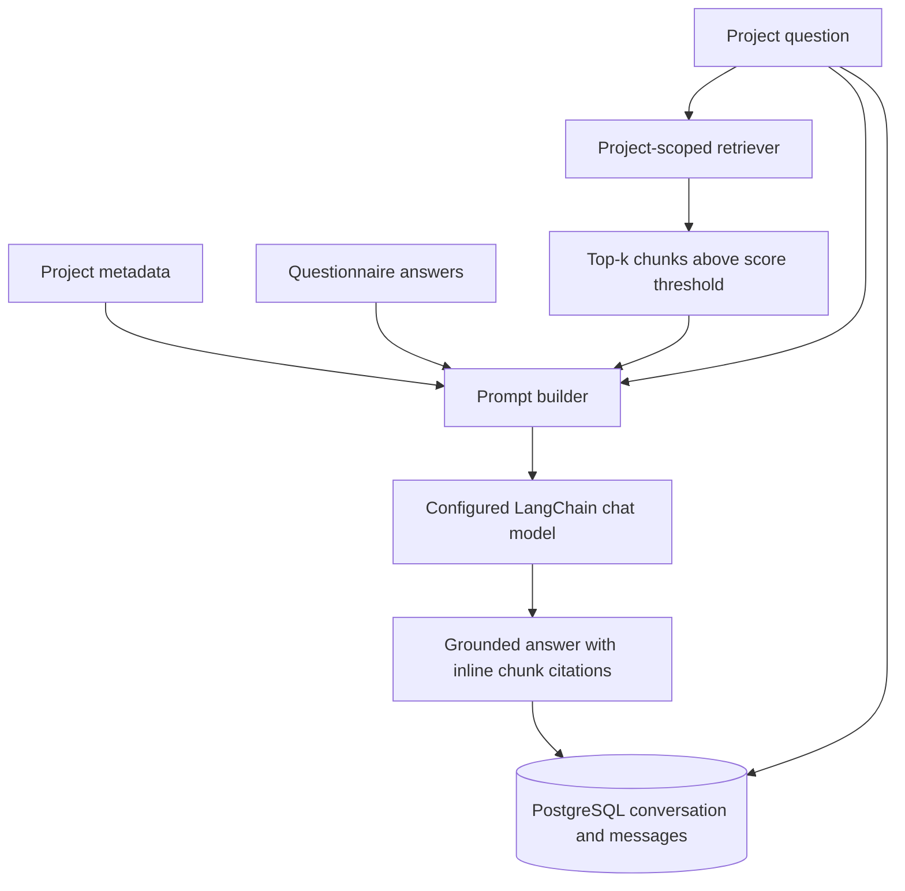
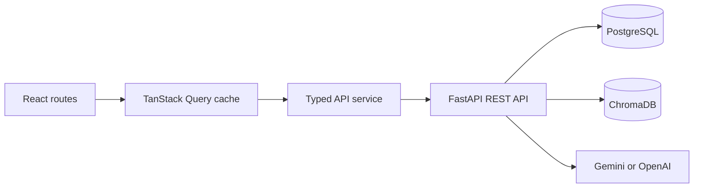
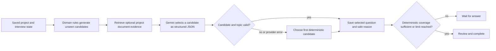
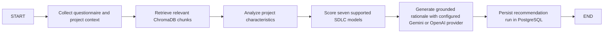

# Requirements Studio

Requirements gathering application with an adaptive interview, requirements and governance agents, persistent multi-agent analysis history, document ingestion, vector search, grounded RAG question answering, and LangGraph SDLC workflows. The app combines project metadata, questionnaire answers, interview responses, and project-scoped document evidence for human review.

## RAG architecture



## Project structure

```text
backend/
  alembic/versions/             # initial schema through 0008_analysis_run_history
  app/
    api/routes/                 # projects, interviews, documents, search, RAG, SDLC, agents, and run history
    core/                       # settings, DB session, error handling
    models/                     # project, questionnaire, documents, recommendations, conversations, interviews, analyses
    parsers/                    # PDF, DOCX, TXT parsers
    repositories/               # database queries
    schemas/                    # API request/response models
    services/                   # ingestion, vector, prompt, LLM, RAG, requirements/governance agents, SDLC scoring
  data/uploads/                 # uploaded source documents
  data/chroma/                  # persistent ChromaDB collection
  tests/                        # API, RAG, vector, parser tests
  requirements.txt
  alembic.ini
frontend/                       # React + Vite dashboard, interview, documents, chat, and AI analysis history
  src/components/               # shared navigation, states, error boundary, toasts
  src/lib/                       # TanStack Query client, cache keys, validation
  src/pages/                     # home, project dashboard, questionnaire, docs, chat, recommendation
  src/services/api.ts            # typed FastAPI client
  src/test/                      # Vitest and React Testing Library setup
docker-compose.yml
.env.example
```

## Phase 8 frontend dashboard

The frontend uses FastAPI as its source of truth. TanStack Query caches reads, retries transient backend failures, and invalidates project/document/recommendation/conversation queries after mutations. API failures surface in-page and through toast notifications, with an application-wide error boundary for unexpected render errors. No browser storage is required for project persistence.



Routes:

| Route | Screen |
|---|---|
| `/` | Analytics overview and backend project list |
| `/projects/new` | New project questionnaire flow |
| `/projects/:projectId/questionnaire` | Existing project questionnaire |
| `/projects/:projectId` | Project dashboard, questionnaire summary, documents, embedding status, recommendation, recent conversations |
| `/projects/:projectId/recommendation` | Generate/view recommendation, confidence, reasoning, risks, mitigations, testing and delivery notes, history |
| `/projects/:projectId/chat` | RAG chat, conversation history, source citations |
| `/projects/:projectId/documents` | Upload, view metadata/chunk counts, embed, and delete documents |

Frontend configuration is in `frontend/.env` (copy from `frontend/.env.example`). `VITE_API_BASE_URL` defaults to `http://127.0.0.1:8000`. LLM and embedding provider keys are configured on the backend in the root `.env`; see `.env.example`.

Install and run the frontend from the repository root:

```powershell
Set-Location frontend
if (-not (Test-Path .env)) { Copy-Item .env.example .env } else { Write-Output ".env already exists; leaving it unchanged." }
npm install
npm run dev
```

Build and run the frontend tests:

```powershell
npm run build
npm run test
```

Backend integration used by dashboard pages:

| Feature | Endpoint |
|---|---|
| Project list/details/update | `GET /api/projects`, `GET /api/projects/{id}`, `PUT /api/projects/{id}` |
| Documents, deletion, embedding | `GET/POST /api/projects/{id}/documents`, `DELETE /api/projects/{id}/documents/{doc_id}`, `POST /api/projects/{id}/documents/{doc_id}/embed`, `GET /api/projects/{id}/documents/{doc_id}/embedding-status` |
| Search and RAG chat | `POST /api/search`, `POST /api/projects/{id}/ask`, `GET /api/projects/{id}/conversations`, `GET /api/projects/{id}/conversations/{conversation_id}` |
| SDLC recommendations | `POST /api/projects/{id}/recommend-sdlc`, `GET /api/projects/{id}/recommendation-history` |
| Cross-project analytics | `GET /api/analytics/summary` |

The backend also exposes document preview/chunk APIs, RAG evaluation/debug endpoints, and SDLC comparison. See Swagger UI at `http://127.0.0.1:8000/docs` for full request and response schemas.

## Setup and run

Requires Python 3.11+, Docker Desktop, and Node.js for the frontend. Local sentence-transformer embeddings are used by default, and Gemini generates RAG answers by default. Set `GEMINI_API_KEY` in `.env` before using `/ask` or `/evaluate-rag`. From the repository root:

```powershell
if (-not (Test-Path .env)) { Copy-Item .env.example .env } else { Write-Output ".env already exists; leaving it unchanged." }
# Set GEMINI_API_KEY in .env before using /ask or /evaluate-rag.
docker compose up -d postgres
Set-Location backend
py -m venv ..\.venv
..\.venv\Scripts\Activate.ps1
python -m pip install -r requirements.txt
alembic upgrade head
uvicorn app.main:app --reload --host 127.0.0.1 --port 8000
```

PostgreSQL uses host port `5433` to avoid conflicts with a local PostgreSQL service. Embeddings default to `EMBEDDING_PROVIDER=local` and `EMBEDDING_MODEL=all-MiniLM-L6-v2`; the first local embedding run downloads the model weights. To use OpenAI embeddings, set `EMBEDDING_PROVIDER=openai` and `EMBEDDING_MODEL=text-embedding-3-small` in `.env` and provide `OPENAI_API_KEY`. RAG chat defaults to `LLM_PROVIDER=gemini`, `GEMINI_MODEL=gemini-3.8-flash`, and `GEMINI_FALLBACK_MODEL=gemini-3.6-flash,gemini-3.7-flash`; set `GEMINI_API_KEY` in `.env`. Temporary Gemini capacity errors (429/5xx) try each configured fallback model in order. For backward compatibility, set `LLM_PROVIDER=openai`, `LLM_MODEL=gpt-4o-mini`, and `OPENAI_API_KEY` to use OpenAI chat instead. Chat provider/model settings are independent of the embedding provider. `CHROMA_PERSIST_DIRECTORY` and `CHROMA_COLLECTION_NAME` continue to configure the same persistent vector storage. Gemini uses Google's `google-genai` SDK; OpenAI chat remains on `langchain-openai`.

New Chroma vectors record their embedding provider, model, and dimension. Legacy vectors without these tags are treated as stale and are regenerated when **Embed** is run for that document. Embedding calls are bounded to batches of 64 chunks by default (`EMBEDDING_BATCH_SIZE`, clamped to 1–512); a failed multi-batch run removes partial vectors before reporting failure. Changing an existing collection from OpenAI vectors to MiniLM vectors still requires a one-time reindex because their dimensions differ; back up the Chroma directory before rebuilding it. PostgreSQL document chunks and uploaded originals remain available for re-embedding.

Run the frontend separately with `cd frontend`, `npm install`, and `npm run dev`.

## Frontend project submission

The questionnaire frontend calls FastAPI directly at `http://127.0.0.1:8000` by default. To use another backend URL, set `VITE_API_BASE_URL` in `frontend/.env`. Project lists, project details, questionnaire answers, and uploaded documents are loaded from the backend; the frontend does not use browser storage for project persistence. A new questionnaire draft is held only while its tab remains open until submission.

The submit flow uses these APIs:

| Method | Endpoint | Submission step |
|---|---|---|
| POST | `/api/projects` | Create a project and receive its backend project ID |
| PUT | `/api/projects/{id}` | Update project profile fields when continuing an existing project |
| POST | `/api/projects/{id}/questionnaire` | Save questionnaire responses |
| POST | `/api/projects/{id}/documents` | Upload each selected PDF, DOCX, or TXT file (`file` multipart field) |
| GET | `/api/projects/{id}` | Load project, questionnaire, and documents on open/refresh |
| GET | `/api/projects?limit=100&offset=0` | Load existing projects from the backend |

To manually verify the frontend and PostgreSQL persistence:

1. Start PostgreSQL, apply migrations, and run FastAPI using the commands in Setup and run.
2. In another terminal run `cd frontend`, `npm install` (first run only), and `npm run dev`.
3. Open the Vite URL, choose **New project**, complete the questionnaire, optionally attach documents, and submit.
4. Confirm the success page displays the backend project ID. Refresh that page; project details and saved answers should load again from FastAPI. Use **Home** → **Existing project** to verify the project appears from the database.
5. Confirm PostgreSQL rows (replace the query as needed):

```powershell
docker exec requirements-postgres psql -U requirements -d requirements_db -c "SELECT id, project_name FROM projects ORDER BY created_at DESC LIMIT 5;"
docker exec requirements-postgres psql -U requirements -d requirements_db -c "SELECT project_id, requirement_stability, risk_level FROM questionnaire_responses ORDER BY created_at DESC LIMIT 5;"
docker exec requirements-postgres psql -U requirements -d requirements_db -c "SELECT project_id, original_filename FROM uploaded_documents ORDER BY created_at DESC LIMIT 5;"
```

The database check for `uploaded_documents` is applicable only when a file was attached. The upload endpoint also stores the original file and parsed chunks under the backend data directory.

## Database and migrations

`conversations` stores a project ID and creation time. `messages` stores its conversation ID, role (`user` or `assistant`), content, and creation time. Foreign keys cascade on project/conversation deletion. Conversation messages are returned in insertion order.

Apply and inspect migrations from `backend/`:

```powershell
alembic upgrade head
alembic current
```

Phase 6 adds `0004_rag_conversations` after the vector metadata migration. Roll back only the conversation schema with `alembic downgrade 0003_vector_search_metadata`. ChromaDB persists separately in `backend/data/chroma`; uploaded originals are in `backend/data/uploads`.

## APIs

Swagger UI: `http://127.0.0.1:8000/docs`; OpenAPI JSON: `/openapi.json`.

| Method | Endpoint | Purpose |
|---|---|---|
| POST | `/api/projects/{id}/documents` | Upload and chunk a PDF, DOCX, or TXT |
| POST | `/api/projects/{id}/documents/{doc_id}/embed` | Create and persist chunk vectors |
| POST | `/api/search` | Vector search scoped to a project |
| POST | `/api/projects/{id}/ask` | Ask a grounded project question |
| POST | `/api/projects/{id}/evaluate-rag` | Inspect retrieved chunks, selected context, final prompt, answer, and metrics |
| GET | `/api/projects/{id}/retrieval-debug` | Inspect ranked retrieval results and metadata without an LLM call |
| GET | `/api/projects/{id}/conversations/{conversation_id}` | Read persisted conversation history |
| POST | `/api/projects/{id}/recommend-sdlc` | Run LangGraph retrieval, questionnaire scoring, Gemini/OpenAI reasoning, and persist the recommendation |
| GET | `/api/projects/{id}/recommendation-history` | List persisted LangGraph recommendation runs |
| POST | `/api/projects/{id}/compare-sdlc` | Compare two supported SDLC models using questionnaire and retrieved evidence |
| POST | `/api/projects/{id}/interview/start` | Create or resume a domain-aware requirements interview |
| POST | `/api/projects/{id}/interview/answer` | Save an answer and select a deterministic adaptive follow-up |
| GET | `/api/projects/{id}/interview/state` | Read the saved question and answer history, coverage, and progress |
| POST | `/api/projects/{id}/interview/complete` | Complete the interview after the final answer |

### Adaptive requirements interview (Phase 9)

The project wizard now starts with the project idea, business objective, and user roles. The backend detects a likely domain (including banking, payments, lending, insurance, healthcare, education, commerce, logistics, public services, HR, and manufacturing) and selects a domain-specific opening question. If the idea is unclear or describes a general inventory tool, it uses the generic software system profile. A domain hint in the project profile is used only when text-based detection cannot classify the idea.

Questions come from a deterministic, domain-aware candidate bank so answering does not wait for a Gemini request. Gemini selection is optional via `INTERVIEW_LLM_SELECTION_ENABLED=true`; it can only select supplied candidates and cannot author questions or control interview state. Stakeholders can skip a question; skipped topics remain uncovered and are excluded from generated requirements. The minimum is 6 questions, the default maximum is 12, and high-risk or complex projects can receive up to 15. A deterministic sufficiency check can finish earlier when required coverage is present. Answers mentioning a gateway, manual approval, fraud, audit, or security can prioritize focused follow-ups. Existing RAG retrieval provides optional document evidence and filters out redundant candidate questions. The SDLC recommendation workflow is unchanged.

Phase 10 question selection follows this sequence:



The selector receives the project idea, objective, roles, domain, previous questions and answers, topic coverage, available candidates, and up to five retrieved evidence chunks. It returns `selected_question_id`, matching `topic`, `priority`, and one short user-safe `reason`. The backend validates the ID against the current unseen candidates and validates the topic before saving it. Provider errors, timeouts, invalid keys, malformed JSON, rate limits, and invalid or duplicate selections are logged without logging prompts, complete answers, or keys; the interview continues using deterministic candidate ordering. The frontend displays only the selected question and its short explanation.

The `interview_sessions` PostgreSQL table stores the idea, objective, user roles, detected domain, question/answer history, covered and uncovered topics, current question, progress limit, and completion status. `0005_adaptive_interviews` adds the table without changing existing project or questionnaire records. The existing questionnaire APIs and table remain available as before.

Example PowerShell requests (first create a project using `POST /api/projects` and use its returned ID):

```powershell
$projectId = "<project-id>"
$startBody = @{
  project_idea = "A hospital appointment booking system for local clinics"
  business_objective = "Reduce booking time and avoid scheduling conflicts"
  users_roles = "Patients, reception staff, clinicians"
} | ConvertTo-Json
$state = Invoke-RestMethod -Uri "http://127.0.0.1:8000/api/projects/$projectId/interview/start" -Method Post -ContentType "application/json" -Body $startBody
$state | ConvertTo-Json -Depth 8
$answerBody = @{ question_id = $state.current_question.id; answer = "Patients choose a clinic and appointment slot; staff can reschedule." } | ConvertTo-Json
Invoke-RestMethod -Uri "http://127.0.0.1:8000/api/projects/$projectId/interview/answer" -Method Post -ContentType "application/json" -Body $answerBody
Invoke-RestMethod -Uri "http://127.0.0.1:8000/api/projects/$projectId/interview/state"
# Repeat /answer with each returned current_question. Once current_question is null:
Invoke-RestMethod -Uri "http://127.0.0.1:8000/api/projects/$projectId/interview/complete" -Method Post
```

The React wizard provides previous/next question navigation, saves answers to PostgreSQL, resumes on refresh, and presents a complete Q&A review before the user finishes the interview. The existing SDLC questionnaire follows this interview and continues to use its original endpoint and schema.

### Requirements analysis agent (Phase 11)

The requirements analysis agent creates a versioned draft from project metadata, the saved questionnaire, any adaptive interview answers, and project-scoped chunks retrieved from ChromaDB. It classifies functional, non-functional, business-rule, data, integration, security/privacy/compliance, and operational requirements; records source evidence; flags ambiguity and conflicting evidence; and reports coverage gaps, testability, and clarification questions. Every generated draft is persisted with status `needs_review`; when the LLM response fails validation or the provider is unavailable, the API persists a deterministic, questionnaire/interview-based draft with status `partial`. The agent never marks results approved.

Migration `0006_requirements_analyses` adds the versioned `requirements_analyses` table. From `backend/`, apply it with `alembic upgrade head`. The newest analysis is returned by the read endpoint.

| Method | Endpoint | Purpose |
|---|---|---|
| POST | `/api/projects/{project_id}/analyze-requirements` | Generate and persist a draft. Optional body: `{"top_k": 5}`. |
| GET | `/api/projects/{project_id}/requirements-analysis` | Read the latest persisted analysis. |

Example PowerShell calls:

```powershell
$projectId = "<project-id>"
$analysis = Invoke-RestMethod -Uri "http://127.0.0.1:8000/api/projects/$projectId/analyze-requirements" -Method Post -ContentType "application/json" -Body '{"top_k":5}'
$analysis | ConvertTo-Json -Depth 12
Invoke-RestMethod -Uri "http://127.0.0.1:8000/api/projects/$projectId/requirements-analysis" | ConvertTo-Json -Depth 12
```

The response includes deterministic requirement IDs, category, priority, confidence, provenance, quoted evidence, acceptance criteria, ambiguity, dependencies, tags, and testability. Source references are checked against the actual project context and unsupported citations cause the agent to return its safe partial draft. Review the draft with stakeholders before treating it as an approved specification. Tests: `python -m pytest backend/tests/test_requirements_analysis.py -q` (all backend tests: `python -m pytest backend/tests -q`).

### Governance & SDLC agent (Phase 12)

The Governance Agent requires a saved Phase 11 Requirements Analysis. It consumes that structured result, project details, questionnaire answers, available project-scoped retrieved evidence, and the existing deterministic SDLC scorecard from `score_sdlc_models`. Gemini adds a validated governance plan; it does not replace the Requirements Agent or the deterministic recommender. If Gemini fails, returns malformed JSON, uses unsupported enums, or cites unknown requirements/evidence, the service persists a deterministic plan using the existing scorecard and reports `status: partial` plus a safe `fallback_reason`. Plans are persisted for human review. No API keys, full prompts, or raw model output are stored or logged.

Migration `0007_governance_analyses` adds versioned governance results linked to both the project and the exact requirements analysis used. Apply from `backend/` using `alembic upgrade head`.

| Method | Endpoint | Purpose |
|---|---|---|
| POST | `/api/projects/{project_id}/governance-analysis` | Generate and persist a governance plan; requires a Phase 11 analysis. |
| GET | `/api/projects/{project_id}/governance-analysis` | Return the latest saved governance plan. |

Example PowerShell calls:

```powershell
$projectId = "<project-id>"
# Run POST /api/projects/$projectId/analyze-requirements first if no Phase 11 result exists.
$governance = Invoke-RestMethod -Uri "http://127.0.0.1:8000/api/projects/$projectId/governance-analysis" -Method Post
$governance | ConvertTo-Json -Depth 14
Invoke-RestMethod -Uri "http://127.0.0.1:8000/api/projects/$projectId/governance-analysis" | ConvertTo-Json -Depth 14
```

The response includes the methodology and concise evidence-linked reasoning, deterministic baseline scores, project assessment, lifecycle phases, requirement-linked testing/security activities, documentation, checkpoints, risks, quality gates, prerequisites, and unresolved questions. Supported methods include Agile, Waterfall, Iterative, Spiral, Hybrid, and the existing V-Model, Incremental, Agile Scrum, and RAD scorecard methods. Generated plans use `needs_review`; deterministic or upstream-partial results use `partial`. The UI remains unchanged in this phase.

Create a project and upload a document using the existing project endpoints. Embed it before asking document-grounded questions:

```powershell
curl.exe -X POST "http://127.0.0.1:8000/api/projects/$projectId/documents" -F "file=@backend/sample_data/meeting_notes.txt;type=text/plain"
curl.exe -X POST "http://127.0.0.1:8000/api/projects/$projectId/documents/$documentId/embed"
curl.exe -X POST "http://127.0.0.1:8000/api/projects/$projectId/ask" -H "Content-Type: application/json" -d "{\"question\":\"Which SDLC model fits the project evidence?\",\"top_k\":5,\"score_threshold\":0.2}"
curl.exe -X POST "http://127.0.0.1:8000/api/projects/$projectId/evaluate-rag" -H "Content-Type: application/json" -d "{\"question\":\"Which SDLC model fits the project evidence?\",\"top_k\":5,\"score_threshold\":0.2}"
curl.exe "http://127.0.0.1:8000/api/projects/$projectId/retrieval-debug?question=loan%20decision&top_k=5&score_threshold=0.2"
```

For a direct PowerShell test of both RAG chat endpoints, configure `GEMINI_API_KEY` in `.env`, restart FastAPI, then run:

```powershell
$projectId = "8f6a425d-1824-46a3-a874-ffa36c0c5804"
$requestBody = @{ question = "What risks and requirements are described in the uploaded document?"; top_k = 5; score_threshold = 0.2 } | ConvertTo-Json
Invoke-RestMethod -Uri "http://127.0.0.1:8000/api/projects/$projectId/ask" -Method Post -ContentType "application/json" -Body $requestBody
Invoke-RestMethod -Uri "http://127.0.0.1:8000/api/projects/$projectId/evaluate-rag" -Method Post -ContentType "application/json" -Body $requestBody
```

Use an existing project ID that has been created in this backend if the example ID is not present in your database. The `ask` result contains the answer, citations, and conversation ID; `evaluate-rag` also shows the selected context, rendered prompts, and request metrics.

Ask request fields: `question` (required), `top_k` (default 5, max 50), `score_threshold` (default 0.2, range -1 through 1), `filters` (optional Chroma metadata filters), and `conversation_id` (optional to continue a conversation). The response contains `answer`, source `chunk_id`/`document_id`/`score` objects, and a `conversation_id` to continue or fetch the conversation.

Each answer is prompted to use only supplied project/questionnaire/retrieved context, cite used chunks inline as `[chunk_id=<id>]`, and explicitly say when information is insufficient. The source list contains retrieved chunks that met the score threshold. Answers are generated only at request time; this phase does not generate reports or recommendations automatically.

`evaluate-rag` returns one-based chunk ranks, scores, text and metadata, the selected context, both rendered prompts, the generated answer, and metric values. `retrieval-debug` accepts optional JSON metadata filters through the `filters` query parameter, for example `filters=%7B%22filename%22%3A%22meeting_notes.txt%22%7D`. RAG logs include retrieval time, prompt character size, prompt token estimate, answer-generation time, and answer token estimate; prompt and answer contents are not logged. Token values are estimates based on word and punctuation units.

### LangGraph SDLC recommendations

The recommendation workflow is:



The deterministic scoring engine returns a 0–100 score for Waterfall, V-Model, Incremental, Iterative, Spiral, Agile Scrum, and RAD. Scores come from questionnaire answers plus small adjustments for retrieved document evidence; unembedded documents do not affect a recommendation. The LLM explains the top-ranked supported model and cites retrieved document claims with `[chunk_id=<id>]`. DevOps is treated as a delivery/operations practice and Kanban as a flow-management method; neither appears in the SDLC scorecard, alternatives, or comparison choices. The recommendation response includes the model scores, confidence estimate, alternatives, strengths, risks, implementation notes, and source chunks. The scoring revision is versioned as `langgraph_v2`; older recommendation history is retained in PostgreSQL but excluded from current recommendation views. If the questionnaire has not been saved, recommendation generation returns HTTP 409.

Example PowerShell requests (set `$projectId` to a project with a saved questionnaire):

```powershell
$projectId = "8f6a425d-1824-46a3-a874-ffa36c0c5804"
$recommendBody = @{ top_k = 5 } | ConvertTo-Json
Invoke-RestMethod -Uri "http://127.0.0.1:8000/api/projects/$projectId/recommend-sdlc" -Method Post -ContentType "application/json" -Body $recommendBody
Invoke-RestMethod -Uri "http://127.0.0.1:8000/api/projects/$projectId/recommendation-history?limit=20&offset=0"
$compareBody = @{ model_a = "Agile Scrum"; model_b = "V-Model"; top_k = 5 } | ConvertTo-Json
Invoke-RestMethod -Uri "http://127.0.0.1:8000/api/projects/$projectId/compare-sdlc" -Method Post -ContentType "application/json" -Body $compareBody
```

`compare-sdlc` returns each model's fit rationale and score, plus tradeoffs, risk analysis, and retrieved source citations. The two model names must differ and must be among the supported models.

SDLC recommendation history reuses the existing `generated_recommendations` table; no database migration or schema change is needed. Each current LangGraph run is a new row marked with `scoring_method=langgraph_v2`. The existing JSON `alternatives` column stores the normal alternatives plus a private `_phase7` metadata object for scores, strengths, implementation notes, and retrieved sources. The recommendation endpoints unwrap that data. Previous LangGraph v1 recommendation rows remain stored but are not shown as current recommendations because their scorecards include retired candidates. The existing `/api/projects/{id}/analyze` and `/api/projects/{id}/recommendation` response schemas remain unchanged.

## Tests

Run from `backend/`:

```powershell
python -m pytest -q
```

Tests use isolated SQLite, temporary upload and Chroma directories, deterministic fake embeddings, and mocked Gemini/OpenAI providers. They do not require external API credentials or download the local embedding model. Coverage includes retrieval thresholds and filters, evaluation output, rank/precision checks, debug metadata, prompt assembly, source attribution, insufficient context, metrics logging, conversation persistence, local embedding provider selection, and Gemini/OpenAI chat provider selection, alongside existing document/vector tests.

## Phase 6 verification checklist

- [x] Questionnaire and project metadata are assembled into the prompt.
- [x] Existing vector retrieval supports top-k, score threshold, and metadata filters.
- [x] Retrieved source chunks are included in grounded prompts and returned in `sources`.
- [x] `evaluate-rag` exposes scores, selected context, rendered prompt, answer, and metrics.
- [x] `retrieval-debug` returns ranked text chunks and Chroma metadata without calling the LLM.
- [x] Metrics log retrieval time, prompt size/token estimate, and answer generation time/token estimate.
- [x] Insufficient context is stated explicitly in the answer prompt and tested.
- [x] Conversations and user/assistant messages persist in PostgreSQL.
- [x] All 38 backend tests pass with mocked embeddings, LLM providers, and SDLC workflow coverage.
- [ ] Live RAG responses require `GEMINI_API_KEY` by default; OpenAI chat remains available through `LLM_PROVIDER=openai` and `OPENAI_API_KEY`.
- [x] Phase 7 adds a LangGraph SDLC recommendation and comparison workflow; no multi-agent workflow or automatic final reports were added.

The recommendation scorecard uses a LangGraph workflow; Phase 13 adds a separate LangGraph orchestration route for the Phase 11 Requirements Analysis Agent and Phase 12 Governance Agent. SDLC recommendation runs are saved as recommendation records, while multi-agent executions are saved in the Phase 15 `analysis_runs` history.

### Phase 13 multi-agent orchestration

`POST /api/projects/{project_id}/orchestrate` coordinates the existing adaptive interview, Requirements Analysis Agent, and Governance Agent. The graph validates each persisted agent result before handoff and conditionally skips governance if requirements analysis fails validation. Legacy, unlinked analysis rows can be adopted once; later orchestration runs create distinct agent outputs. Both underlying services retain responsibility for analysis, persistence, RAG use, and deterministic fallback.

The endpoint requires a completed adaptive interview and returns HTTP 409 otherwise. Each execution is stored as an `analysis_runs` row with a monotonically increasing project version, terminal status, timestamps, and safe warnings/errors. Requirements and governance outputs link to their run while their existing version-history endpoints remain available. Concurrent runs for one project are rejected; stale `running` rows are recovered after `ANALYSIS_RUN_STALE_AFTER_MINUTES` (default 120). Agent fallback is reported as `partial`. Only transient timeouts, network errors, and provider 502/503/504 failures are retried; `ORCHESTRATION_MAX_RETRIES` defaults to `1` and is capped at `2`.

Example PowerShell request:

```powershell
$projectId = "<project-id-with-completed-interview>"
$body = @{ top_k = 5 } | ConvertTo-Json
Invoke-RestMethod -Uri "http://127.0.0.1:8000/api/projects/$projectId/orchestrate" -Method Post -ContentType "application/json" -Body $body | ConvertTo-Json -Depth 16
```

The graph nodes are `load_project_context`, `load_interview`, `run_requirements_agent`, `validate_requirements`, `run_governance_agent`, `validate_governance`, and `finalize`. A conditional edge after requirements validation routes failures directly to finalization. Each execution and its agent output links are stored in `analysis_runs` (Phase 15).

### Phase 15 persistent analysis history

Migration `0008_analysis_run_history` adds the `analysis_runs` table and nullable `analysis_run_id` links on requirements and governance analyses. Run versions are project-scoped; each run stores its status (`running`, `completed`, `partial`, or `failed`), timestamps, orchestration version, per-agent statuses, warnings, and safe errors. An active-run constraint prevents duplicate concurrent execution for the same project. The stale-run timeout is configurable with `ANALYSIS_RUN_STALE_AFTER_MINUTES`.

| Method | Endpoint | Purpose |
| --- | --- | --- |
| GET | `/api/projects/{project_id}/analysis-runs?limit=50&offset=0` | List newest run versions and summary counts. |
| GET | `/api/projects/{project_id}/analysis-runs/{run_id}` | Load one run with the exact requirements and governance outputs it produced. |

Apply the migration from `backend/` with `alembic upgrade head`. The AI Analysis page now lists saved versions and loads historical outputs without replacing them with the latest run. Tests: `python -m pytest backend/tests/test_analysis_runs.py -q` and `npm run test -- --run` from `frontend/`.
